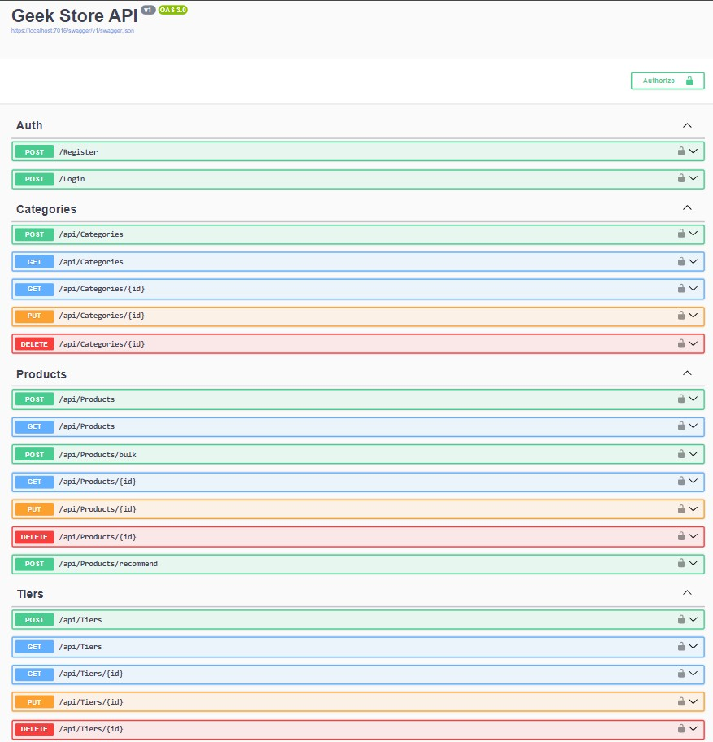
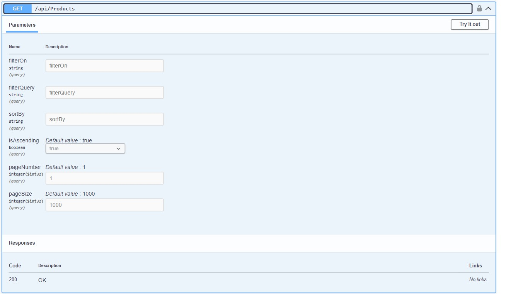

# GeekStore API

GeekStore is a high-performance backend platform for PC part management and LLM-powered build recommendations — built with ASP.NET Core, PostgreSQL, and pgvector.

  
  
  
<p3>(Animated explanations below)</p3>

## Description

GeekStore is an API-first backend platform designed to manage products, tiers, and categories for computer hardware. It features secure authentication and role-based authorization, CRUD functionality for all core resources, and a smart recommendation engine powered by an LLM integrated via Groq API.

This project is built using **ASP.NET Core Web API** and **Entity Framework Core**, with advanced vector similarity search using **pgvector** in PostgreSQL and AI integration through **Groq LLM API** to implement **Retrieval Augmented Generation (RAG)**. It also includes a Python microservice for **embedding generation**, keeping architecture modular and clean.

## Technologies Used

- **C# ASP.NET Core Web API**
- **Entity Framework Core + PostgreSQL + SQL Server**
- **pgvector** for vector similarity search
- **Groq LLM API** for intelligent build generation
- **AutoMapper** for clean DTO mappings
- **Python (optional)** for embedding service via `pythonnet`

---

## Endpoints Overview
### Authentication Endpoints

**Purpose**: Handles user identity management.
**Database used**: SQLServer 16

| HTTP Method | Endpoint             | Description                              | Role Required |
|-------------|----------------------|------------------------------------------|----------------|
| POST        | /api/auth/register   | Register a new user with roles           | None           |
| POST        | /api/auth/login      | Authenticate user and return JWT token   | None           |

### Consumer Endpoints

**Purpose**: Controllers manage CRUD operations on different resources. Role-based access control is enforced.
**Database used**: PostgreSQL 17

**Roles**: Admin, Writer, Reader

| HTTP Method | Endpoint             | Minimum Role |
|-------------|----------------------|---------------|
| POST        | /api/resource         | Writer        |
| GET         | /api/resource/{id}    | Reader        |
| GET         | /api/resource         | Reader        | (Query is also possible with filters, more details below)
| PUT         | /api/resource/{id}    | Writer        |
| DELETE      | /api/resource/{id}    | Writer        |

---

## Recommendation Engine

A cutting-edge feature that helps users build optimized PC configurations using **Retrieval Augmented Generation (RAG)**.

### How It Works

[Product Creation Codeflow]

1. **Product Creation & Embedding**
   - When a new product is added, it is saved to the PostgreSQL and returns a response immediately.
   - An embedding request is queued at the same time to generate embedding for the product via `IEmbeddingService`.
   - The resulting vector is stored in PostgreSQL using the **pgvector** extension alongside product data.

[Recommendation Codeflow]

2. **User Query**
   - The user sends a plain-text requirement like:  
     *"I need a gaming PC under 1 Lakh rupees with a strong GPU."*

3. **Query Embedding**
   - The input query is passed to a Python-based microservice (`IEmbeddingService`) that generates a semantic vector.

4. **Similarity Search**
   - A **cosine similarity search** is performed on the stored product vectors (via `pgvector`) using Entity Framework + PostgreSQL.

5. **Top Matches Per Category**
   - The backend retrieves the **top 5 most relevant products per category** (CPU, GPU, RAM, etc.). Also implements low confidence rejection for accurate results.

6. **LLM-Powered Optimization**
   - The shortlisted products and the original query are sent to a **Groq-hosted LLM**.
   - The LLM returns **two optimized PC builds** in the form of category-product ID mappings.
   - The engine implements graceful fallback messaging, ensuring clear and user-friendly responses even when no valid recommendations are found.

7. **DTO Mapping & Final Output**
   - The recommended product IDs are mapped to full product details.
   - Two complete build recommendations are sent back to the client as `RecommendationsDto`.

### Performance & Scalability

- The engine is built to handle **millions of products** thanks to:
  - **PostgreSQL + pgvector**, optimized for fast vector similarity search even with high-dimensional data.
  - Efficient indexing via **HNSW**, ensuring sub-millisecond query times.
  - Stateless services and modular design — ideal for horizontal scaling under heavy load.
- **LLM processing and embedding are fully offloaded**, keeping the API lightweight and performant under concurrent usage.
- **Real-time recommendations stay fast** — even as your product catalog grows exponentially.

### Example Query

- Request: I need a PC for video editing and occasional gaming under ₹80,000.
- Response: Returns two build recommendations optimized for **editing + budget gaming**, using the most relevant components available.

---
## Endpoints Elaborated

| Controller         | Endpoint               | Method | Role Required | Description                                 |
| ------------------ | ---------------------- | ------ | ------------- | ------------------------------------------- |
| **Auth**           | `/api/auth/register`   | POST   | None          | Register a new user                         |
|                    | `/api/auth/login`      | POST   | None          | Authenticate and receive JWT token          |
| **Products**       | `/api/products`        | GET    | Reader        | Get all products (with filters/sorting)     |
|                    | `/api/products/{id}`   | GET    | Reader        | Get product by ID                           |
|                    | `/api/products`        | POST   | Writer        | Create a new product                        |
|                    | `/api/products/{id}`   | PUT    | Writer        | Update product by ID                        |
|                    | `/api/products/{id}`   | DELETE | Writer        | Delete product by ID                        |
| **Tiers**          | `/api/tiers`           | GET    | Reader        | Get all tiers                               |
|                    | `/api/tiers/{id}`      | GET    | Reader        | Get tier by ID                              |
|                    | `/api/tiers`           | POST   | Writer        | Create a new tier                           |
|                    | `/api/tiers/{id}`      | PUT    | Writer        | Update tier by ID                           |
|                    | `/api/tiers/{id}`      | DELETE | Writer        | Delete tier by ID                           |
| **Categories**     | `/api/categories`      | GET    | Reader        | Get all categories                          |
|                    | `/api/categories/{id}` | GET    | Reader        | Get category by ID                          |
|                    | `/api/categories`      | POST   | Writer        | Create a new category                       |
|                    | `/api/categories/{id}` | PUT    | Writer        | Update category by ID                       |
|                    | `/api/categories/{id}` | DELETE | Writer        | Delete category by ID                       |
| **Recommendation** | `/api/recommendations` | POST   | Reader        | Generate PC build recommendations (via LLM) |

#### Endpoints screeshot in swagger
)

#### Product Listing Features

- **Filtering** on fields: `name`, `tier`, `category`
- **Sorting** on fields: `name`, `tier`, `category`
- **Pagination** with customizable page size
- **Strict parameter validation**
- **Role-based access** (`Reader`, `Writer`, `Admin`)

#### Example Request

GET /api/products?filterOn=category&filterQuery=GPU&sortBy=tier&isAscending=false&pageNumber=1&pageSize=10

#### Query Parameters

| Parameter     | Type   | Description                                                                 |
|---------------|--------|-----------------------------------------------------------------------------|
| `filterOn`    | string | Field to filter on (`name`, `tier`, `category`)                             |
| `filterQuery` | string | Value to search for in the specified `filterOn` field (Any for name, complete name for category and tier)                    |
| `sortBy`      | string | Field to sort by (`name`, `tier`, `category`)                               |
| `isAscending` | bool   | `true` for ascending, `false` for descending                                |
| `pageNumber`  | int    | Page number (starts from 1)                                                 |
| `pageSize`    | int    | Number of results per page (default: 1000, ideal for large datasets)        |

#### Swagger Screenshot of product query features

### Performance & Scalability

- Supports **millions of products**
- Utilizes **PostgreSQL + indexes** for blazing fast queries
- Designed to scale under **high concurrent loads**

---

## QuickStart

### Follow these steps to get GeekStore API up and running locally:

### 1. Clone the Repository
- git clone https://github.com/your-username/GeekStore.git
- cd GeekStore
### 2. Setup Environment Variables
#### Create a .env file at the root of the project with the following keys:

 
<strong>📄 .env Example</strong> (click to expand)

#### #PostgreSQL for Product Catalog
GeekStoreConnectionString=Host=localhost;Port=5432;Database=GeekStoreDb;Username=your_username;Password=your_password

#### #SQL Server or PostgreSQL for Auth Database
GeekStoreAuthDbConnectionString=Server=localhost;Database=GeekStoreAuthDb;Trusted_Connection=True;TrustServerCertificate=True

#### #JWT Configuration
JWT_Key=your_super_secret_key
JWT_Issuer=https://localhost:7016/
JWT_Audience=https://localhost:7016/

#### #Python Embedding Service (if using pythonnet)
PythonDLLPath=C:/Path/To/pythonXY.dll
PythonScriptsFolder=C:/Path/To/GeekStore/Python

#### #Groq AI Configuration
GroqApiKey=your_groq_api_key
GroqLLMModel=llama3-8b-instruct

## 3. Apply Migrations
#### Navigate to the API project directory
- cd GeekStore.API

#### Apply migrations to both databases
- dotnet ef database update --context GeekStoreDbContext
- dotnet ef database update --context GeekStoreAuthDbContext

## 4. Run the Project
- dotnet run --project GeekStore.API

## 5. Test with Swagger
- Visit: https://localhost:1234/swagger
